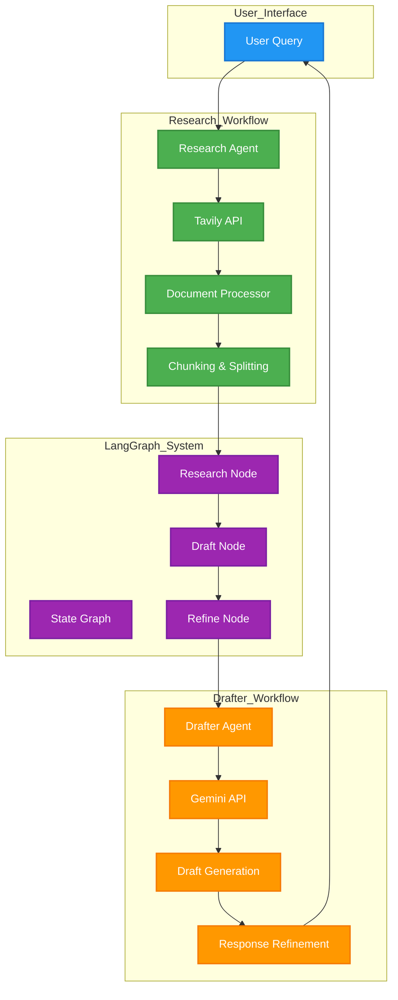

# Deep-Research-Agentic-AI
A sophisticated AI-powered research system that intelligently crawls websites using Tavily for online information gathering. The system employs a dual-agent architecture with one agent focused on research and data collection, while the second agent functions as an answer drafter. The system utilizes the LangGraph and LangChain frameworks to effectively organize and process gathered information.

## System Architecture
The system consists of two main components that work together to provide comprehensive research and response generation:

- **Research Agent**: Crawls websites using Tavily to gather relevant information and processes it into structured documents.

- **Drafter Agent**: Drafts and refines responses using the Gemini API, ensuring clarity and accuracy.

## System Architecture Diagram

The diagram above illustrates the complete flow of the system:

- **User Query:** The user submits a query through the interface.

- **Research Agent:** Crawls websites using Tavily API, processes the data, and splits it into manageable chunks.

- **LangGraph Workflow:** Manages the state and flow of the research process, including research, drafting, and refining nodes.

- **Drafter Agent:** Uses the Gemini API to generate and refine responses based on the research data.

- **Response:** The final response is returned to the user.

## Technologies Used

- Python 3.12.3
- LangChain
- LangGraph
- Tavily API
- Google Gemini API
- Streamlit (for the web interface)

## Setup and Installation
1. Clone the repository:
```bash
git clone https://github.com/yourusername/deep-research-ai.git
cd deep-research-ai
```

2. Create a virtual environment:
```
python -m venv venv
source venv/bin/activate  # On Windows: venv\Scripts\activate
```

3. Install the required dependencies:
```
pip install -r requirements.txt
```

4.Set up your environment variables:
```
# Create a .env file with:
TAVILY_API_KEY=your_tavily_api_key
GOOGLE_STUDIO_API_KEY=your_google_studio_api_key
```

5.Run the Streamlit Application:
```
streamlit run app/streamlit_app.py
```
## System Components
1. Research Agent
The Research Agent is responsible for crawling websites and gathering relevant information. It uses the Tavily API to search the web and processes the results into structured documents.

2. Drafter Agent
The Drafter Agent generates and refines responses using the Gemini API. It ensures the responses are clear, concise, and relevant to the user's query.

3. LangGraph Workflow
The LangGraph framework manages the workflow, ensuring smooth transitions between research, drafting, and refining stages.

## Features
- **Web Crawling:** Uses Tavily API to gather relevant information from the web.

- **Document Processing:** Splits and processes documents into manageable chunks for better handling.

- **Response Drafting:** Generates clear and concise responses using the Gemini API.

- **Response Refinement:** Refines responses for clarity and brevity.

- **Workflow Management:** Uses LangGraph to manage the research and drafting workflow.

## Usage Example
```
workflow = ResearchWorkflow()
query = "What is the latest news on COVID-19 vaccines?"
response = workflow.run(query)
print("Final Response:")
print(response)
```
#### Response Formats
The system provides responses in the following format:

1. **Summary:** A brief summary of the research findings.

2. **Sources:** A list of relevant source URLs.

Example:
```
Summary: The latest news on COVID-19 vaccines includes updates on booster shots and new variants. Booster shots are now recommended for all adults, and new variants are being closely monitored.

Sources:
- https://example.com/news1
- https://example.com/news2
- https://example.com/news3
```
## Acknowledgments
- Tavily for the web crawling API.
- Google Gemini for the language model.
- LangChain and LangGraph for the workflow management framework.
